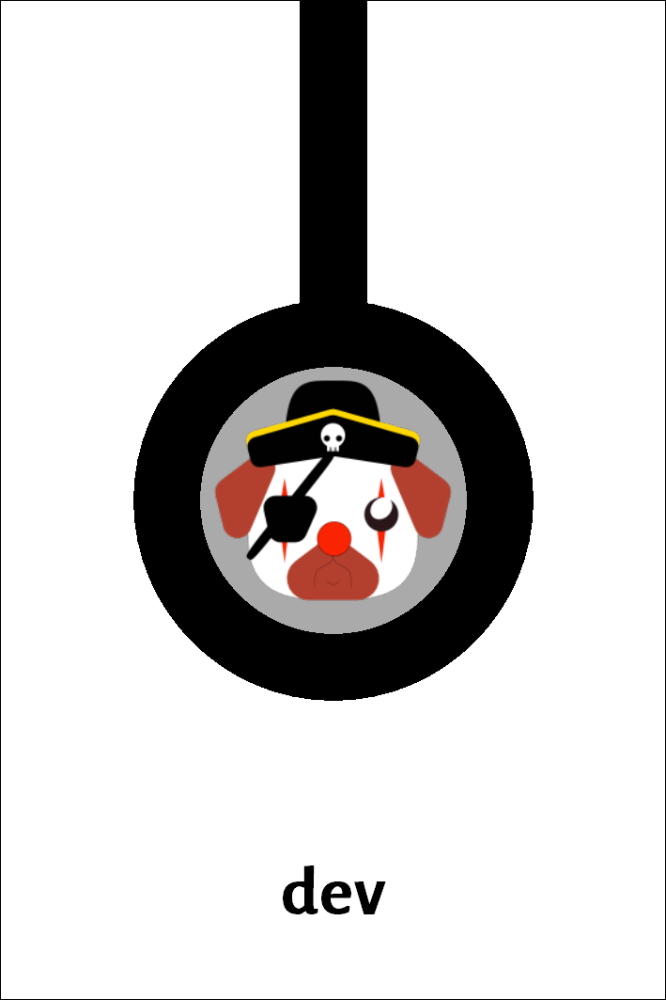
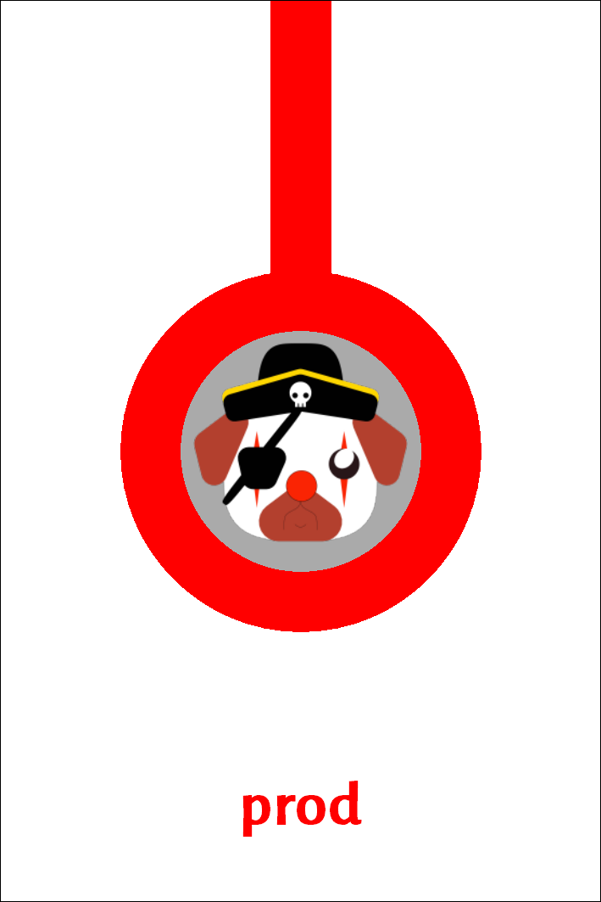

# Git Gud

Educational card game based on Git workflows

## Introduction

`Git Gud` is an educational game whose purpose is to teach to use Git workflows. Many workflows are available, the one chosen here is the [Gitflow workflow](https://www.atlassian.com/git/tutorials/comparing-workflows/gitflow-workflow).

The participants play the role of developers working on a common project, using the Gitflow workflow. They develop new code on the *development* (`dev`) branch, and when they think the project has progressed enough, they move the code to the *production* (`prod`) branch, test and release the software. The project that advanced the furthest wins.

As [Git](https://git-scm.com/) is a collaborative tool, the game is mostly collaborative, or at least, collaborative/competitive. Two or three players play a collaborative game in the same team. Four players can choose either to play collaboratively in the same team, or to play competitively with two teams of two players each playing against each others. The game has not been tested for more than four players, feel free to improvise your own rules if you play with more than four players.

## Set up

Each team receives two *repository cards* (see the following images)

## Turn of play

## Game end

## Scoring
