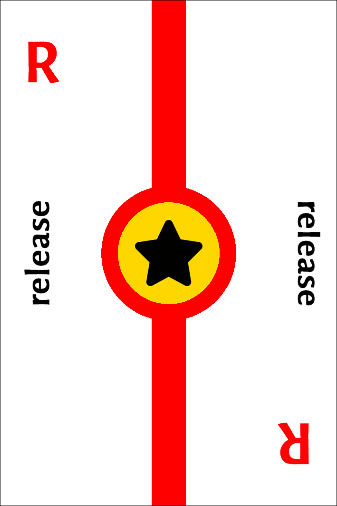

# Git Gud

Educational card game based on Git workflows

*rules v0.1 2024-09-01*

## Introduction

`Git Gud` is an educational game whose purpose is to teach to use Git workflows. Many workflows are available, the one chosen here is the [Gitflow workflow](https://www.atlassian.com/git/tutorials/comparing-workflows/gitflow-workflow).

The participants play the role of developers working on a common project, using the Gitflow workflow. They develop new code on the *development* (`dev`) branch, and when they think the project has progressed enough, they move the code to the *production* (`prod`) branch, test and release the software. The project that advanced the furthest wins.

As [Git](https://git-scm.com/) is a collaborative tool, the game is mostly collaborative, or at least, collaborative/competitive. Two or three players play a collaborative game in the same team. Four players can choose either to play collaboratively in the same team, or to play competitively with two teams of two players each playing against each others. The game has not been tested for more than four players, feel free to improvise your own rules if you play with more than four players.

## Set up

*The full deck of card is [available here](deck/full_deck.pdf). I advise you to print the deck in cardstock paper for better quality. Most printshops will cut the cards for you for an extra fee.*

Each team receives two *repository cards*: one red `prod` card and one black `dev` card. Put these cards face up in front of one of the two players of the team, with the red `prod` card to the left of the black `prod` card, like this:

If there's only one team in the game, place aside the remaining two repository cards.

Next pick the *first player*: the first player is the one who has most recently switched off an electronic device (PC, tablet or smartphone). The first player shuffles the deck of cards, deals one card to each other player, and deals **three cards** to themselves. Then, they place the remaining cards face down to form the *draw deck* and flip the top card of the draw deck and place it face up to form the *discard pile*. Now the game can begin.

## Turn of play

Starting from the first player and moving clockwise, each player performs the following actions:

### 1. Play a card or discard a card

The player chooses one of the three cards in their hand and decides either to play it on the *active branch* of their team's repository, or to discard it on top of the discard pile. To play the card on their team's repository, the player needs to follow the placement rules listed in the next section. If a player cannot follow any of the rules, then they are forced to discard a card. The player can always discard any card to the discard pile, even if fulfils one of the placement rules.

### 2. Pass the cards

The player passes the two remaining cards in their hand to the player to their left. At the end of the game, the player may have only one card left, so they pass just that one card.

### 3. Draw a card

The player draws a card either from the top of the draw deck or from the top of the discard pile. However, a player cannot draw from the discard pile if they discarded a card in their turn; i.e. they cannot pick up the card they just discarded.

## Card placement rules

1. Each player can place cards on a branch of their team's repository, they are not allowed to place cards in another team's repository.
2. Each team can place cards in their repository matching the color of the card and the branch. For example, `commit` cards are black, thus they can only be placed on the black `dev` branch. On the other hand, `test` and `release` cards are red, so they can be played only on the red `prod` branch. The `merge` and `branch` cards are special, and their placement rules will be explained in detail below.
3. Each repository at any time has an *active* and an *inactive* branch. Cards can only be played on an active branch, while respecting rules 1 and 2. At the beginning of the game, the black `dev` branch is active and the red `prod` branch is inactive. Active and inactive branches can be switched by the `merge` and `branch` cards.

> Example: Player Melissa wants to play a black `commit` card on the black `dev` branch of their team's repository, as this is in accord with rules 1 and 2. However, in a previous round, their teammate Eric has played the `merge` card, which made the `dev` branch inactive, voiding rule 3. Melissa must decide either to play another card or discard.

### Commit card

- The `commit` card can only be played on the black `dev` branch, while this branch is active. There are no further restrictions.
- When you play a `commit` card, you place it above the last played card of the `dev` branch.
- Commit cards earn points at the end of the game, so make sure to play as many as you can.

> Example: how to play a `commit` card.
> 
> 

### Merge card

- The `merge` card can only be played on the black `dev` branch, while this branch is active.
- Moreover, the `merge` card can only be played if it's preceded by at least one `commit` card. This means that the `merge` card cannot be played as the first card on the `dev` branch, nor can it be played after a `branch` card.
- When you play a `merge` card, you rotate it 90 degrees and place it above the last played card of the `dev` branch, straddling the two branches.
- The `merge` card makes the black `dev` branch inactive and the red `prod` branch active.

> Example: how to play a `merge` card.
> 
> 

### Test card

- The `test` card can only be played on the red `prod` branch, while this branch is active.
- The `test` card can only be played after a `merge` card or another `test` card. It cannot be played after a `release` card.
- When you play a `test` card, you place it above the last played card of the `prod` branch.
- The `test` cards together with the `release` cards are necessary to score points (see Scoring section).

> Example: how to play a `test` card.
> 
> 

### Release card

- The `release` card can only be played on the red `prod` branch, while this branch is active. There are no further restrictions.
- When you play a `release` card, you place it above the last played card of the `prod` branch.
- The `release` cards together with the `test` cards are necessary to score points (see Scoring section).

> Example: how to play a `release` card. _Note: although this move is allowed, it won't score you points. You need to play a test card before you play a release card!_
> 
> 

### Branch card

- The `branch` card can only be played on the red `prod` branch, while this branch is active. There are no further restrictions.
- When you play a `branch` card, you rotate it 90 degrees and place it above the last played card of the `prod` branch, straddling the two branches.
- The `branch` card makes the red `prod` branch inactive and the black `dev` branch active.

> Example: how to play a `branch` card.
> 
> 

## Game end

The game ends when there are no cards left in the draw deck and no cards left in the players' hands.

## Scoring

## Epilogue

By playing this game, I hope you learned the basics of Gitflow, in particular:

- The production branch is sacred! Don't push commits to it, but merge from the development branch, giving your colleagues an opportunity to check your work.
- Release only after extensive testing!
- Teamwork and communication is essential!
